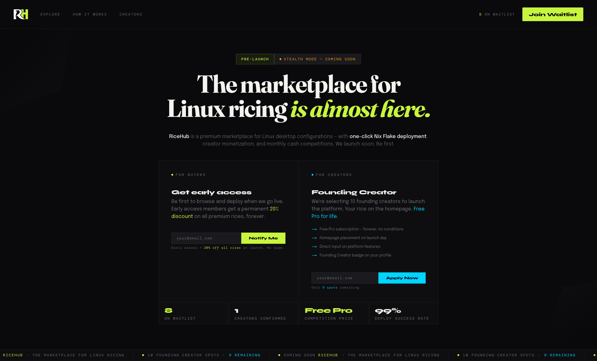

# RiceHub Waitlist

Frontend for the RiceHub waitlist site, built with Preact, Vite and Tailwind.



## Requirements

- [pnpm](https://pnpm.io/) (see `packageManager` in [package.json](package.json) for the pinned version)
- A running instance of the [waitlist API](https://github.com/ricehub-io/waitlist-api). By default the site expects it at `http://127.0.0.1:3000`. Without the API, form submissions and live data fetching (preview rices, waitlist & founding creator stats) will not work.

## Running locally

Install dependencies and start the dev server:

```sh
pnpm install
pnpm dev
```

You can then access the website on http://127.0.0.1:5173.

To preview a production variant of the frontend locally:

```sh
pnpm preview
```

## Building

```sh
pnpm build
```

The built site is placed to `dist/` directory.

## Site variants

The site has two variants, selected at build time via the `VITE_SITE_VARIANT` environment variable:

- `dev` (default): all sections are enabled (hero, preview, how it works, terminal deploy, pre-launch competition, founding creators, pricing, faq, final cta).
- `prod`: a trimmed-down variant with only hero, preview, founding creators and final cta.

Example:

```sh
VITE_SITE_VARIANT=prod pnpm build
```

See [src/config.ts](src/config.ts) for the section list.

## API URL override

The API URL is read at runtime from `window.__APP_CONFIG__.API_URL`. You can override it by creating a `config.js` file in the same directory as your built website's `index.html` is.

Example `config.js`:

```js
window.__APP_CONFIG__ = {
    API_URL: "https://api.example.com",
};
```

## License

Licensed under the GNU General Public License v3.0. See [LICENSE](LICENSE) for the full text.
